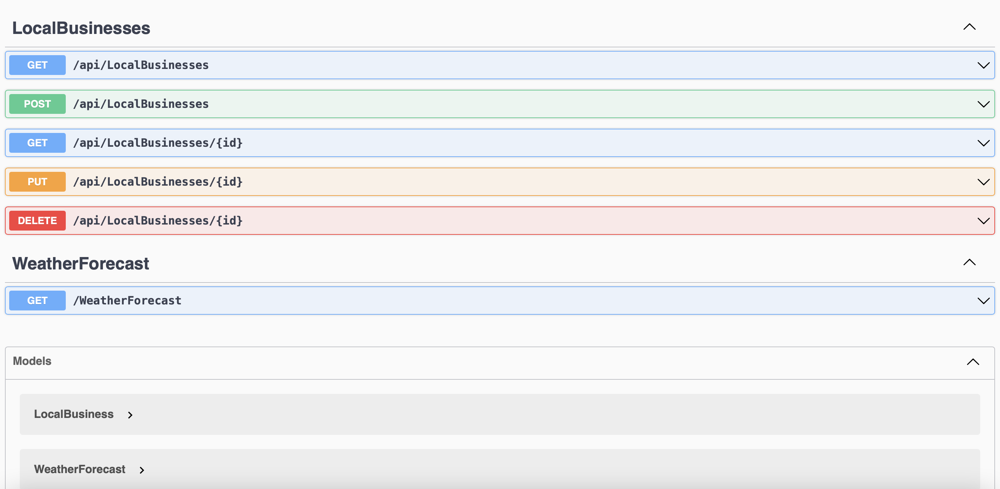

<h1 font-size ="35px" font-family ="Snell Roundhand, cursive"> Local Business API</h1>
# By Meron G. Tekie,

### A web application api built to store information of local business that run with in the community

## 🖥️ Technologies Used

 <br>
 <br>
 <br>
 <br>
<br>
<br>
<br>
<br>

## ✅ Description

It is a web API designed with a purpose of enabling local community to add local businesses that are in the community and be able to get information about the businesses that run with in the community. The application has featured a technology _Swagger_ that enables API's to have a friendly UI that makes user's to ADD,GET,EDIT and DELETE information easily in the Web-Page.

## ⚙️ Setup/Installation Requirements

- First, make sure you have MySql Workbench downloaded and properly installed. You will also need a text editor(Vscode Highly recommended) and a command-line

- In your command line navigate to your desktop directory and clone this project <https://github.com/MeronTekie/local-business-api.git>
- Open the project in your preferred text editor, we recommend VSCode.
- In the root directory, confirm there is a .gitignore file

- Make sure to ignore sensitive data/file so they do not get pushed to remote repository
- Add:

  ```
  */obj/
  */bin/
  */appsettings.json
  ```

- Create an appsetting.json file at the root directory
- Open the appsetting.json file and enter:

- To create the database please do as follows:

  - First create a file  at the root of the project directory called "appsettings.json" and  add the following code to connect your project to the  local database, 

  ```
      {
        "ConnectionStrings": {
          "DefaultConnection": "Server=localhost;Port=3306;database=[your_database];uid=[Your ID];pwd=[Your Password];"
        }
      }
  ```

- Make sure the following packages are restored or type the following in the Project directory.
  - `dotnet add package Microsoft.EntityFrameworkCore -v 5.0.0`
  - `dotnet add package Pomelo.EntityFrameworkCore.MySql -v 5.0.0-alpha.2`
  - `dotnet add package Microsoft.EntityFrameworkCore.Proxies -v 5.0.0`
  - `dotnet add package Microsoft.AspNetCore.Identity.EntityFrameworkCore -v 5.0.0`
- Then do the following accordingly in your terminal to update and connect your project to your local database :
  - `dotnet restore`
  - `dotnet build`
  - `dotnet ef migrations add Initial`
- Once we have verified that the migration looks correct and made any necessary changes, we'll run the following commands:

  - `dotnet ef database update`
  - `dotnet run`
- The above code  will create a new database in your local host  with tables designed to store information related to the project.

- To interact with the local host website navigate to the project directory and run `dotnet run`or `dotnet watch run`
- Click on <http://localhost:5001/> and you will be directed to the Swagger UI which is very user friendly and easy to walk through.
- The image below is the expected page when you run it on your local browser.



## Known Bugs 🐛

- No known Bugs

## License

Licensed under the [MIT License](LICENSE).
Copyright (c) 2022 <br>Meron G.Tekie []
